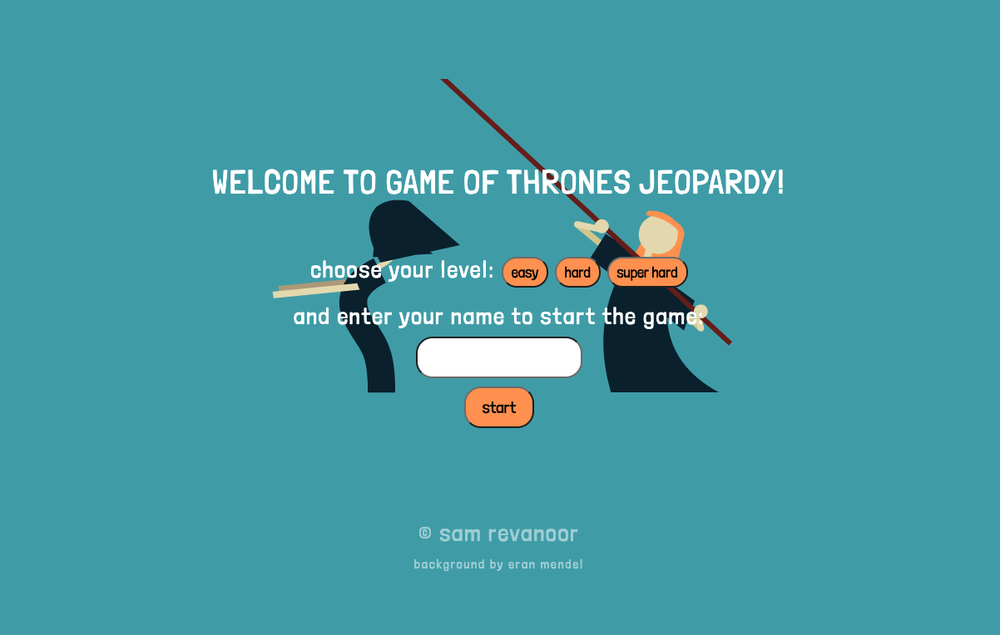
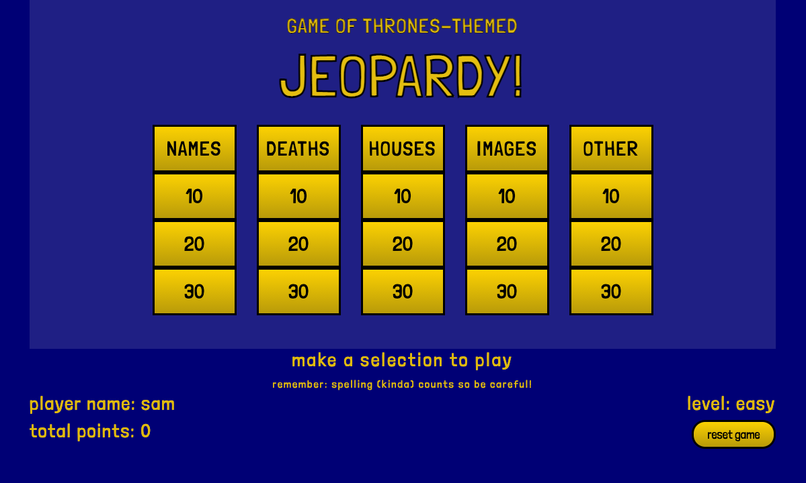
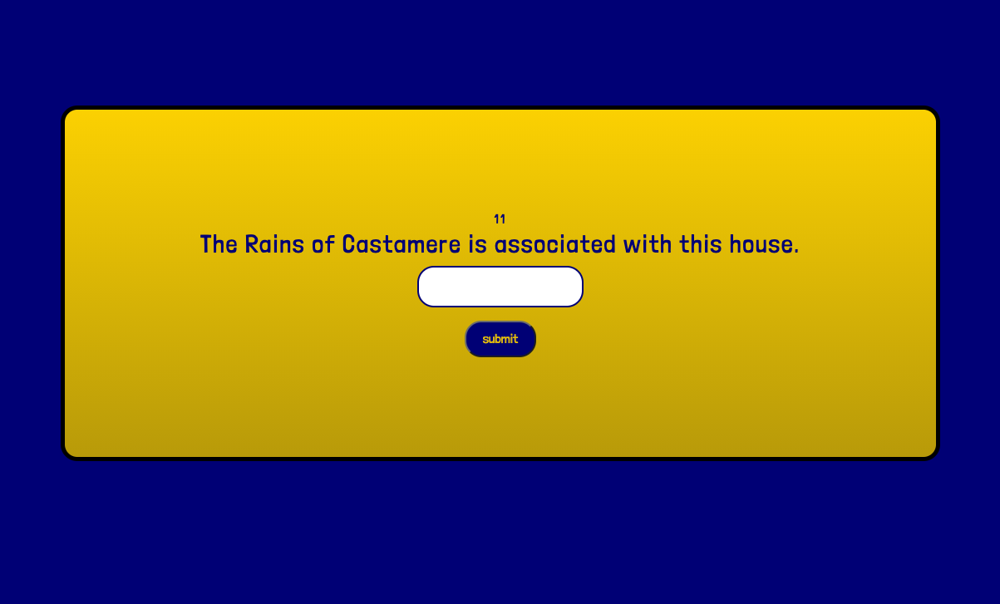
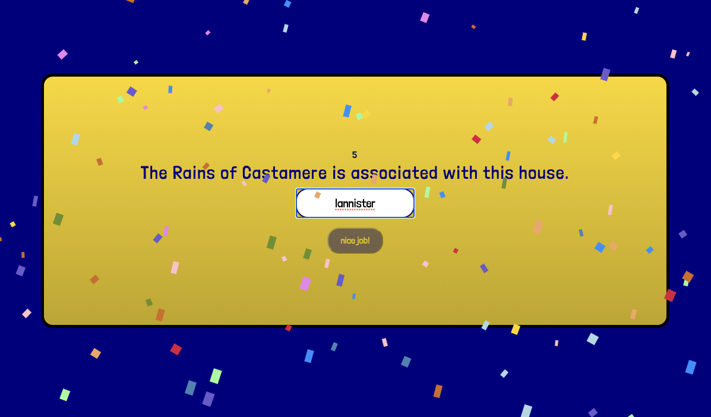
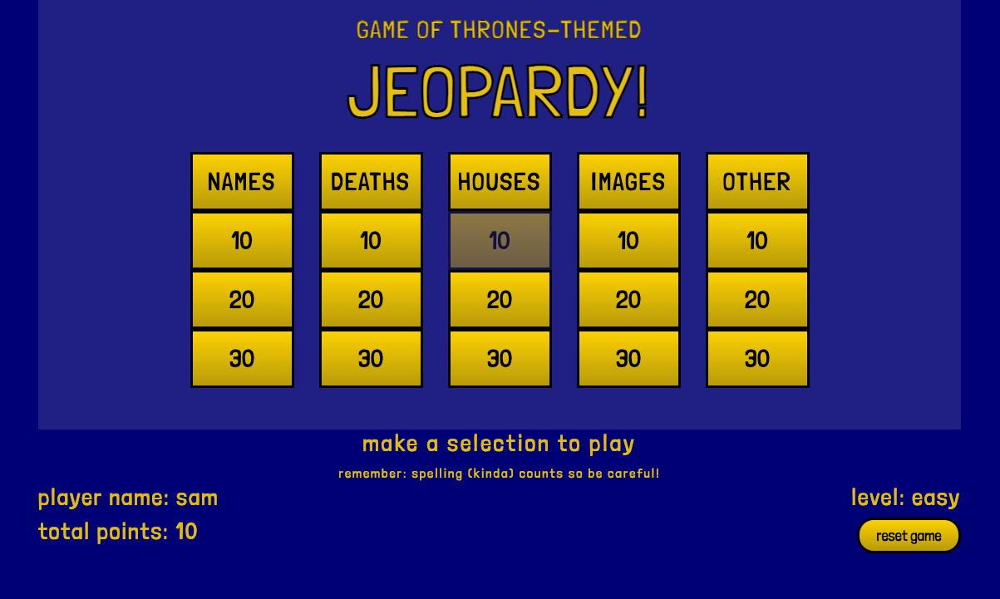
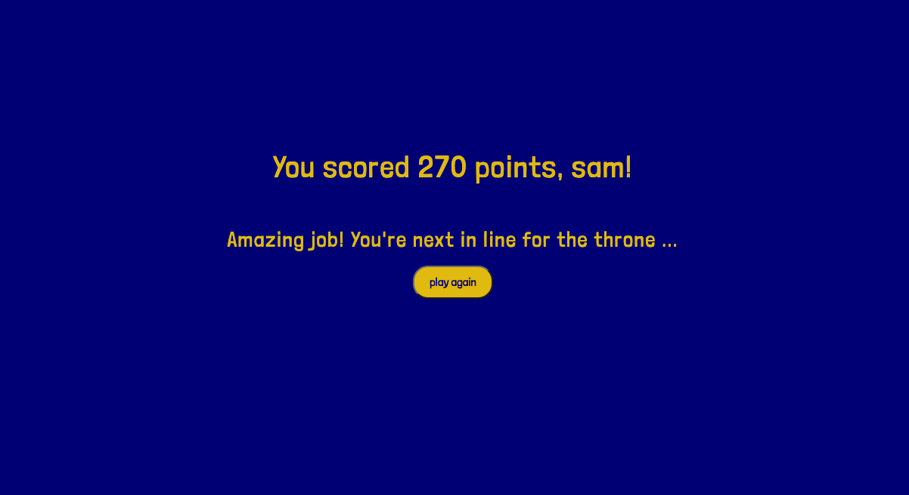

# Game of Thrones-themed Jeopardy!
## by Sam Revanoor

### **Background**

For my first browser game, I combined two of my favourite things: Game of Thrones and the TV show Jeopardy!
 
 
Jeopardy (<em>styled as Jeopardy!</em>) is a television game show that features a quiz competition in which contestants are presented with general knowledge clues in the form of answers, and must phrase their responses in the form of questions.
 
 
Game of Thrones is a fantasy drama television series based on a series of novels by George R. R. Martin.
 
 
My game has a slight twist on Jeopardy, where I don't ask the player to enter the whole question, but rather just the correct response (usually one word or phrase).
 
 

-------

### **Rules**
- Players can choose between 3 levels
- Players have 30 seconds to answer each question
- The questions do not have to be answered in any particular order
- Correct answers add points to the player's total accordingly
- Wrong answers do not change the player's total points
- The maximum points a player can get is 300 (if they guess every question correctly)
- The minimum points a player can get is 0 (if they guess every question incorrectly)
- Player will only have one chance to answer each question
- Player can reset the game at any time

-------

### **Screenshots**

This is the landing page of the game, where players can choose their level. Once they enter their name and click on _Start_, the game will begin.
 
 

This is the game board page, with 5 categories and 3 questions for each category. Players can click on the option they want to try guessing first (it does not have to be done in any specific order).
 
 

When a player clicks on the question they want to answer, the question "card" takes over the page and a 30-second timer begins.
 
 
If the player guesses correctly (see below), confetti will fall down the page. If they guess incorrectly, a dragon will blow fire on them! If they fail to guess in 30 seconds, the question is marked as incorrect and they return back to the game board page. 
 
 

 
 

When they return back to the game board page, the question is marked as "completed" and the points are updated (if they got it right).
 
 
At the end of the game, depending on how many points the player has accumulated, they will see a personalized message at the end and an opportunity to play again.
 
 

-------

### **Technologies**

- HTML
- CSS
- JavaScript
- jQuery
- Bootstrap

-------

### **Getting Started**

You can access my game via this direct link: [Jeopardy!](https://samrevanoor.github.io/jeopardy/)
 

-------

### **Things I'm Proud Of**

- Implementing the confetti when the player guesses correctly
- Adding and timing sound effects based on the player's answer (or lack thereof)
- After a *lot* of trial and error, figuring out my timers!
- I realized I had chosen the "slim" version of jQuery and switched over to the minified one, and all of my animation issues disappeared!
- Coming up with all of the trivia questions on my own (this took a long time ...)
- Working with classes, jQuery and CSS to indicate that a particular question had already been answered
- Learning how to use jQuery animations
- Learning how to manipulate audio using jQuery
- Restructuring my game to make it scalable (i.e.: making it easy to add multiple levels down the line)
- Becoming comfortable with my code 🥰

-------

### **Challenges I Faced**

- Getting the 30-second timer to work for each card and reset at the correct time
- Making sure the timer, once it reached 0, would send the player back to the game board page
- Similar to the previous point, making sure all of my many `setTimeout` functions worked as intended
- Getting rid of the column gaps in the game board when I make the screen size smaller
- Altering the fps (frames per second) of some gifs so they were in time with the music (as much as I could)
- Ensuring my code remains consistent throughout (i.e.: ensuring I used jQuery throughout instead of a mix of jQuery and JS)
- Trying to think of every possible correct (or semi-correct) answer in my array of answers for each question

-------

### **Next Steps**

- Building out more levels
- Adding bonus points for correct spelling
- Adding a progress bar

-------

### **Extras**
- [Wireframing](wireframing.md)
- [Pseudocode](Extras/pseudocode.md)

-------

Thank you for reading! Enjoy playing and please share feedback 😊