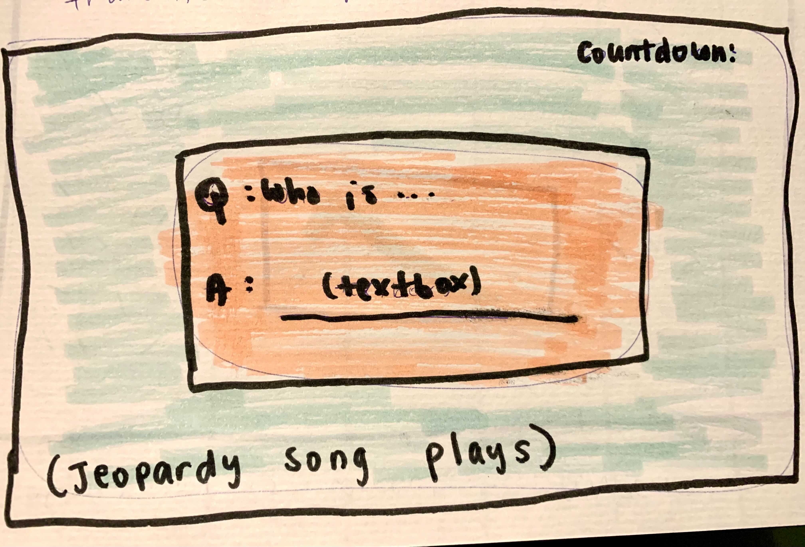

### **Wireframing**

*The following are pictures from the very first planning phase of the game. Please note that a lot of these designs have changed over time, as I came up with new ideas.*

 
 

 
 

 
 

 
 

 
 

 
 

 
 

______________

 

